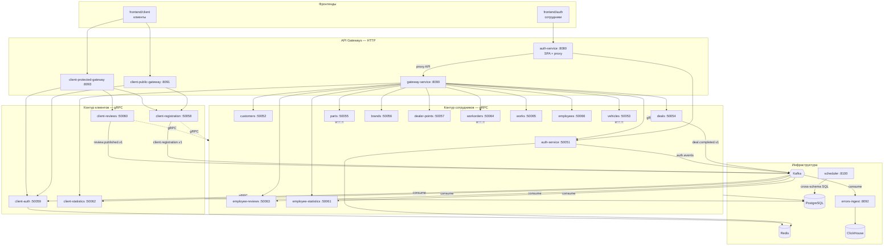

# Общая схема платформы

## Краткое описание слоёв

### Фронтенды

- `frontend/auth` — SPA для сотрудников дилера (продажи, сервис, склад, HR)
- `frontend/client` — SPA для конечных клиентов (регистрация, профиль, отзывы)

### API Gateways

Все gateway используют **grpc-gateway**: HTTP/JSON снаружи, gRPC внутри.

| Gateway | Порт | Назначение |
|---------|------|------------|
| auth-service HTTP | 8080 | SPA + `/api/auth/*` + reverse proxy на gateway-service |
| gateway-service | 8090 | Единая точка входа для доменных API сотрудников |
| client-public-gateway | 8091 | Публичные API клиентов (login, register) |
| client-protected-gateway | 8093 | Защищённые API клиентов (профиль, отзывы) |

### Инфраструктура

| Компонент | Роль |
|-----------|------|
| PostgreSQL | Основное хранилище, schema-per-service |
| Redis | Refresh-токены (auth-service, client-auth) |
| Kafka | Асинхронные события между контурами |
| ClickHouse | Аналитика ошибок (errors-ingest) |
| scheduler-service | Фоновые задачи, cross-schema SQL |

## Связанные документы

- [Контур клиентов](./02-client-contour.md)
- [Контур сотрудников](./03-employee-contour.md)
- [Kafka-события](./04-kafka-events.md)
