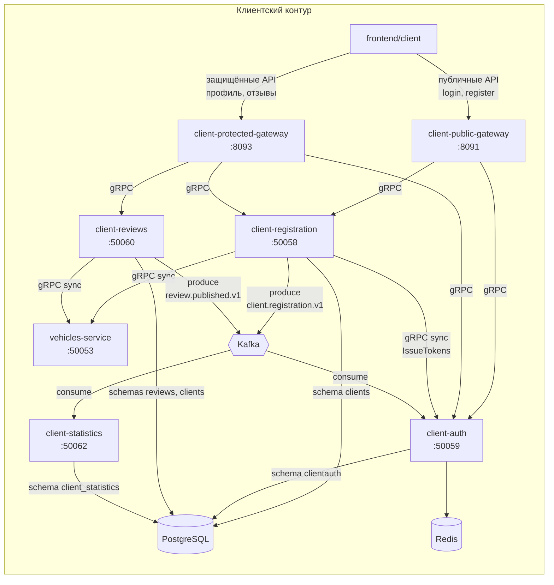
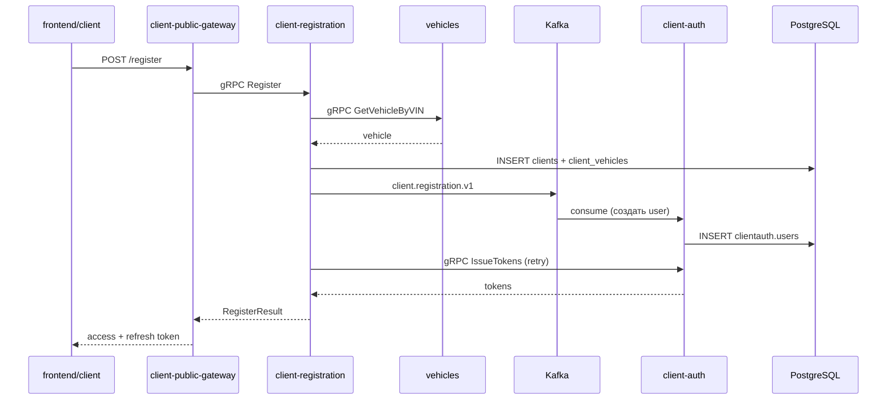
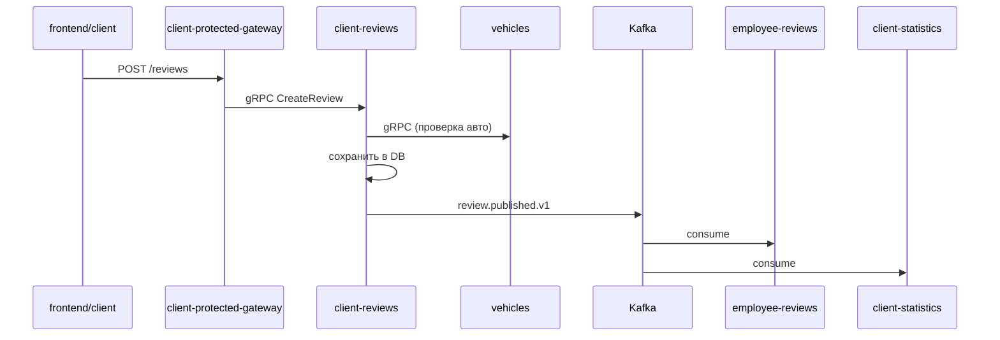

# Контур клиентов



## Сервисы клиентского контура

| Сервис | gRPC | HTTP | Схема БД |
|--------|------|------|----------|
| client-registration-service | 50058 | 8087 | `clients` |
| client-auth-service | 50059 | 8088 | `clientauth` |
| client-reviews-service | 50060 | 8089 | `reviews`, read `clients` |
| client-statistics-service | 50062 | 8095 | `client_statistics` |
| client-public-gateway | — | 8091 | — |
| client-protected-gateway | — | 8093 | — |

## Маршрутизация gateway

### client-public-gateway (:8091)

| Backend | Proto-сервис |
|---------|--------------|
| client-auth | `ClientAuthPublicService` |
| client-registration | `ClientRegistrationPublicService` |

### client-protected-gateway (:8093)

| Backend | Proto-сервис |
|---------|--------------|
| client-auth | `ClientAuthSessionService` |
| client-registration | `ClientAccountService` |
| client-reviews | `ReviewsService` |

## Типовые сценарии

### Регистрация клиента



### Логин

```
frontend/client → client-public-gateway → client-auth (gRPC)
```

### Профиль и автомобили

```
frontend/client → client-protected-gateway → client-registration (ClientAccountService)
```

### Отзыв



## Зависимости от контура сотрудников

Клиентский контур использует **vehicles-service** из employee-контура:

- `client-registration` — поиск авто по VIN при регистрации
- `client-reviews` — привязка отзыва к автомобилю

Публичный gRPC-метод `GetVehicleByVIN` в vehicles-service доступен без employee JWT.

## Связанные документы

- [Общая схема](./01-overview.md)
- [Kafka-события](./04-kafka-events.md)
- [Матрица сервисов](./05-services-interactions.md)
