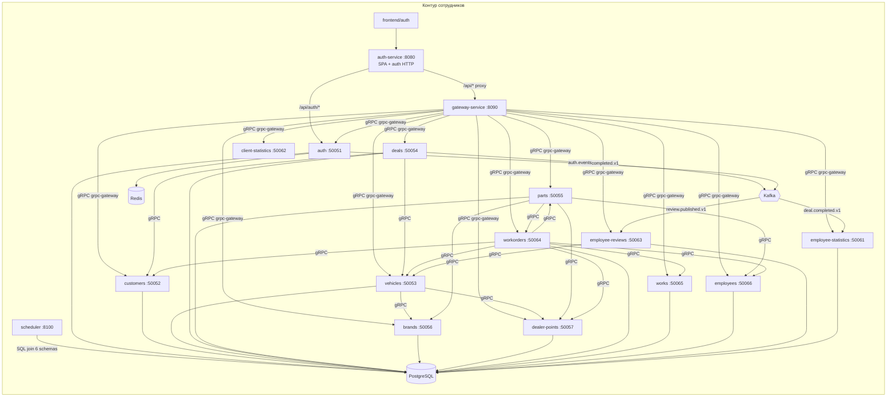
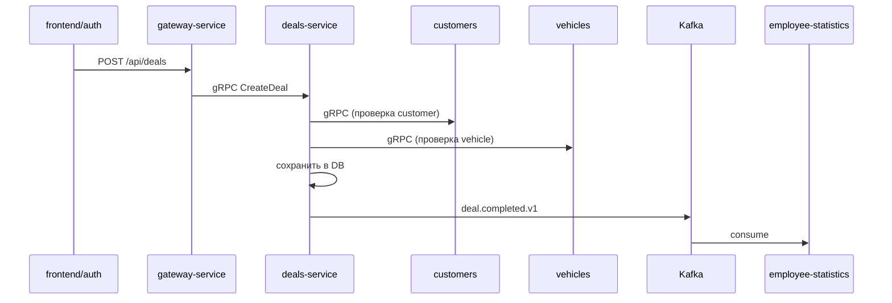
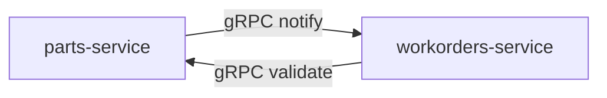

# Контур сотрудников



## Точка входа для фронтенда

`frontend/auth` обращается к **auth-service :8080**:

1. `/api/auth/*` — логин, регистрация, refresh (напрямую в auth gRPC)
2. `/api/customers`, `/api/vehicles`, `/api/deals`, … — reverse proxy на **gateway-service :8090**
3. `/` — статика SPA

## Маршрутизация gateway-service (:8090)

| Backend | Proto-сервис |
|---------|--------------|
| auth-service | `AuthService` |
| customers-service | `CustomersService` |
| vehicles-service | `VehiclesService` |
| deals-service | `DealsService` |
| parts-service | `PartsService` |
| brands-service | `BrandsService` |
| dealer-points-service | `DealerPointsService` |
| employee-statistics-service | `EmployeeStatisticsService` |
| client-statistics-service | `ClientStatisticsService` |
| employee-reviews-service | `EmployeeReviewsService` |
| workorders-service | `WorkOrdersService` |
| works-service | `WorksService` |
| employees-service | `EmployeesService` |

## Типовые сценарии

### Логин сотрудника

```
frontend/auth → auth-service HTTP → auth-service gRPC → PostgreSQL (auth) + Redis (refresh)
```

### CRUD доменной сущности

```
frontend/auth → auth-service (proxy) → gateway-service → <domain-service> gRPC → PostgreSQL
```

### Создание сделки



### Заказ-наряд (workorders)

`workorders-service` — наиболее связанный сервис. При создании/изменении ЗН синхронно валидирует ссылки через gRPC:

| Зависимость | Назначение |
|-------------|------------|
| customers | Проверка клиента |
| vehicles | Проверка автомобиля |
| dealer-points | Проверка точки дилера |
| parts | Проверка запчастей |
| works | Проверка работ |
| employees | Проверка исполнителей |

### Движение запчастей (parts → workorders)



Циклическая зависимость **parts ↔ workorders**: parts уведомляет workorders при подтверждении складского движения; workorders валидирует запчасти при создании ЗН.

### Приглашение на отзыв (scheduler)

`scheduler-service` периодически выполняет cross-schema SQL:

- читает `workorders`, `customers`, `vehicles`, `clients`
- пишет в `reviews.review_invitations`

Не использует gRPC — прямой доступ к нескольким схемам PostgreSQL.

## Доменные сервисы без исходящих gRPC

Сервисы, которые только принимают вызовы (leaf nodes):

| Сервис | Схема БД |
|--------|----------|
| customers-service | `customers` |
| brands-service | `brands` |
| dealer-points-service | `dealerpoints` |
| works-service | `works` |
| employees-service | `employees` |
| employee-statistics-service | `employee_statistics` |

## Связанные документы

- [Общая схема](./01-overview.md)
- [Kafka-события](./04-kafka-events.md)
- [Матрица сервисов](./05-services-interactions.md)
