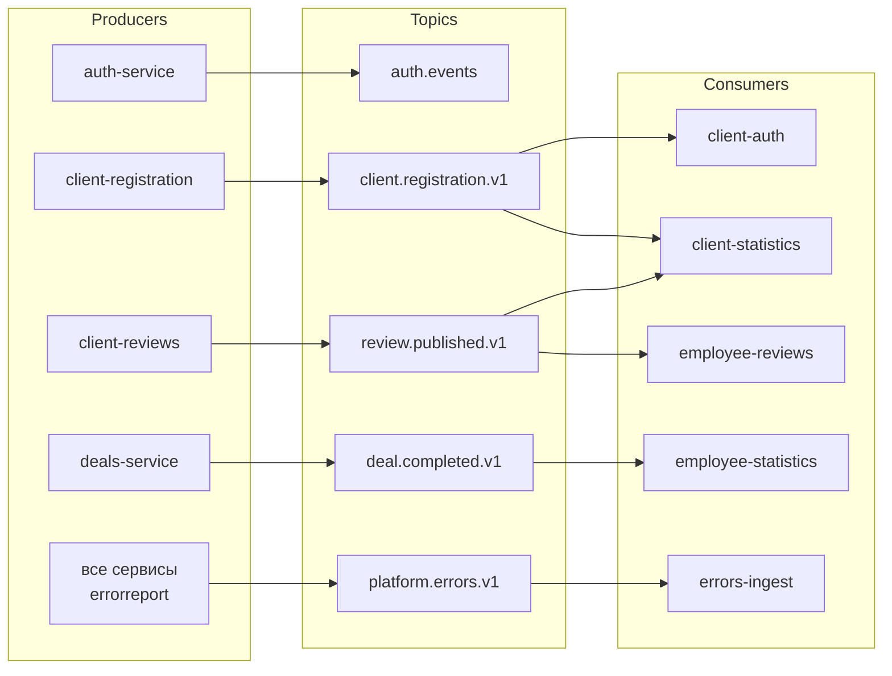
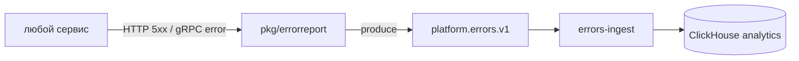

# Kafka-топики и события

## Справочник топиков

| Топик | Producer | Consumer(s) | Назначение |
|-------|----------|-------------|------------|
| `client.registration.v1` | client-registration | client-auth, client-statistics | Создание учётной записи клиента после регистрации |
| `review.published.v1` | client-reviews | employee-reviews, client-statistics | Публикация отзыва клиентом |
| `deal.completed.v1` | deals-service | employee-statistics | Завершение сделки для аналитики продаж |
| `auth.events` | auth-service | — (consumer отсутствует) | События регистрации сотрудников |
| `platform.errors.v1` | все сервисы (через `pkg/errorreport`) | errors-ingest | Централизованный сбор HTTP/gRPC ошибок |

## Consumer groups

| Сервис | Топик | Consumer group (env) |
|--------|-------|----------------------|
| client-auth | `client.registration.v1` | `client-auth` |
| client-statistics | `review.published.v1`, `client.registration.v1` | `client-statistics` |
| employee-reviews | `review.published.v1` | `employee-reviews` |
| employee-statistics | `deal.completed.v1` | `employee-statistics` |
| errors-ingest | `platform.errors.v1` | `errors-ingest` |

## Формат событий

Пакеты с типами событий в репозитории:

| Пакет | Событие |
|-------|---------|
| `pkg/clientevent` | `client.registered` |
| `pkg/reviewevent` | `review.published` |
| `pkg/dealevent` | `deal.completed` |
| `pkg/errorevent` | HTTP/gRPC ошибки |

## Поток ошибок

Дополнительно `auth-service` проксирует телеметрию фронтенда на `errors-ingest` по HTTP (`ERRORS_INGEST_SERVICE_URL`).

## Известные ограничения

- **`auth.events`** — публикуется при регистрации сотрудника, но consumer в коде отсутствует (orphan topic).
- **client-registration** — запись в БД и публикация в Kafka не атомарны (нет transactional outbox). При сбое Kafka клиент создан, учётка в client-auth — нет.

## Связанные документы

- [Контур клиентов](./02-client-contour.md)
- [Контур сотрудников](./03-employee-contour.md)
- [Матрица сервисов](./05-services-interactions.md)
