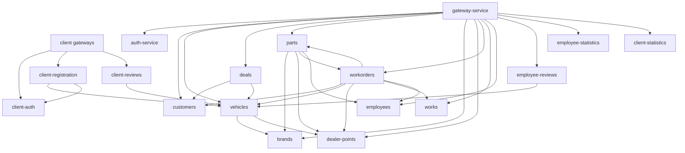

# Взаимодействия по каждому сервису

## Gateways

| Сервис | Порт | Кто вызывает | Исходящие gRPC | Kafka | Хранилище |
|--------|------|--------------|----------------|-------|-----------|
| **gateway-service** | 8090 | frontend/auth (через auth proxy), внешние HTTP | auth, customers, vehicles, deals, parts, brands, dealer-points, workorders, works, employees, employee-reviews, employee-statistics, client-statistics | errors → | — |
| **client-public-gateway** | 8091 | frontend/client | client-auth, client-registration | errors → | — |
| **client-protected-gateway** | 8093 | frontend/client (с JWT) | client-auth, client-registration, client-reviews | errors → | — |

---

## Контур клиентов

| Сервис | Порт | Кто вызывает | Исходящие gRPC | Kafka | PostgreSQL | Прочее |
|--------|------|--------------|----------------|-------|------------|--------|
| **client-registration** | 50058 | public/protected GW | vehicles (VIN), client-auth (токены) | → `client.registration.v1` | `clients` | — |
| **client-auth** | 50059 | public/protected GW, client-registration | — | ← `client.registration.v1` | `clientauth` | Redis |
| **client-reviews** | 50060 | protected GW | vehicles | → `review.published.v1` | `reviews`, read `clients` | JWT на gRPC |
| **client-statistics** | 50062 | employee GW | — | ← `review.published.v1`, `client.registration.v1` | `client_statistics` | JWT |

---

## Контур сотрудников — доменные сервисы

| Сервис | Порт | Кто вызывает | Исходящие gRPC | Kafka | PostgreSQL |
|--------|------|--------------|----------------|-------|------------|
| **auth-service** | 50051 / 8080 | GW, frontend/auth | — | → `auth.events` | `auth` |
| **customers-service** | 50052 | GW, deals, workorders, scheduler† | — | errors → | `customers` |
| **vehicles-service** | 50053 | GW, deals, workorders, client-registration, client-reviews, employee-reviews | brands, dealer-points | errors → | `vehicles` |
| **deals-service** | 50054 | GW | customers, vehicles | → `deal.completed.v1` | `deals` |
| **parts-service** | 50055 | GW, workorders | brands, dealer-points, workorders‡, employees | errors → | `parts` |
| **brands-service** | 50056 | GW, vehicles, parts | — | errors → | `brands` |
| **dealer-points-service** | 50057 | GW, vehicles, parts, workorders | — | errors → | `dealerpoints` |
| **workorders-service** | 50064 | GW, parts‡ | customers, vehicles, dealer-points, parts, works, employees | errors → | `workorders` |
| **works-service** | 50065 | GW, workorders | — | errors → | `works` |
| **employees-service** | 50066 | GW, workorders, parts | — | errors → | `employees` |
| **employee-reviews** | 50063 | GW | vehicles | ← `review.published.v1` | `employee_reviews` |
| **employee-statistics** | 50061 | GW | — | ← `deal.completed.v1` | `employee_statistics` |

† scheduler читает схему напрямую через SQL, не через gRPC  
‡ циклическая связь: parts ↔ workorders

### auth-service — дополнительные роли

| Функция | Описание |
|---------|----------|
| HTTP SPA | Раздаёт `frontend/auth` статику (`STATIC_DIR`) |
| API proxy | Reverse proxy `/api/*` → gateway-service (`GATEWAY_SERVICE_URL`) |
| Telemetry proxy | `/api/telemetry` → errors-ingest (`ERRORS_INGEST_SERVICE_URL`) |
| Redis | Хранение refresh-токенов сотрудников |

---

## Инфраструктурные сервисы

| Сервис | Порт | Кто вызывает | Исходящие | Kafka | Хранилище |
|--------|------|--------------|-----------|-------|-----------|
| **errors-ingest** | 8092 | auth-service (proxy telemetry) | — | ← `platform.errors.v1` | ClickHouse |
| **scheduler-service** | 8100 | — (фоновый worker) | — | errors → | PG: reviews, workorders, deals, customers, clients, vehicles (cross-schema JOIN) |

---

## Матрица gRPC-зависимостей

Строка → столбец: сервис из строки вызывает сервис из столбца.

|  | auth | customers | vehicles | deals | parts | brands | dealer-pts | workorders | works | employees | client-auth | client-reg | client-reviews |
|--|:---:|:---:|:---:|:---:|:---:|:---:|:---:|:---:|:---:|:---:|:---:|:---:|:---:|
| **gateway (emp)** | ✓ | ✓ | ✓ | ✓ | ✓ | ✓ | ✓ | ✓ | ✓ | ✓ | | | |
| **gateway (pub/pr)** | | | | | | | | | | | ✓ | ✓ | ✓† |
| **auth HTTP proxy** | ✓ | | | | | | | | | | | | |
| **deals** | | ✓ | ✓ | | | | | | | | | | |
| **vehicles** | | | | | | ✓ | ✓ | | | | | | |
| **parts** | | | | | | ✓ | ✓ | ✓ | | ✓ | | | |
| **workorders** | | ✓ | ✓ | | ✓ | | ✓ | | ✓ | ✓ | | | |
| **client-registration** | | | ✓ | | | | | | | | ✓ | | |
| **client-reviews** | | | ✓ | | | | | | | | | | |
| **employee-reviews** | | | ✓ | | | | | | | | | | |

† client-reviews — только через client-protected-gateway

---

## Граф синхронных зависимостей (gRPC)

## Связанные документы

- [Общая схема](./01-overview.md)
- [Kafka-события](./04-kafka-events.md)
- [Порты и схемы БД](./06-ports-and-schemas.md)
